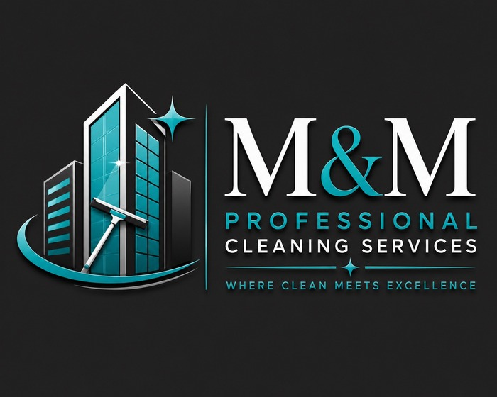
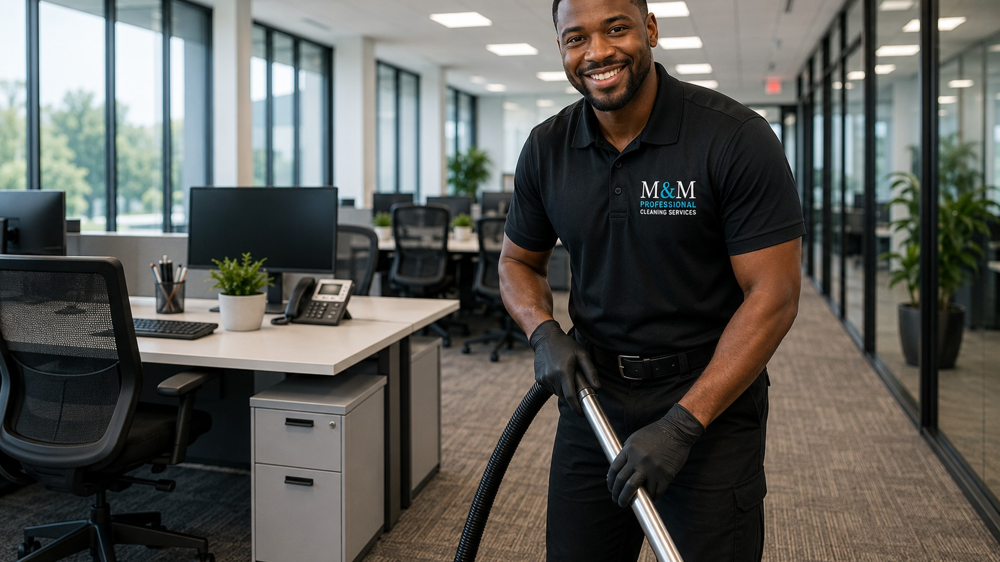
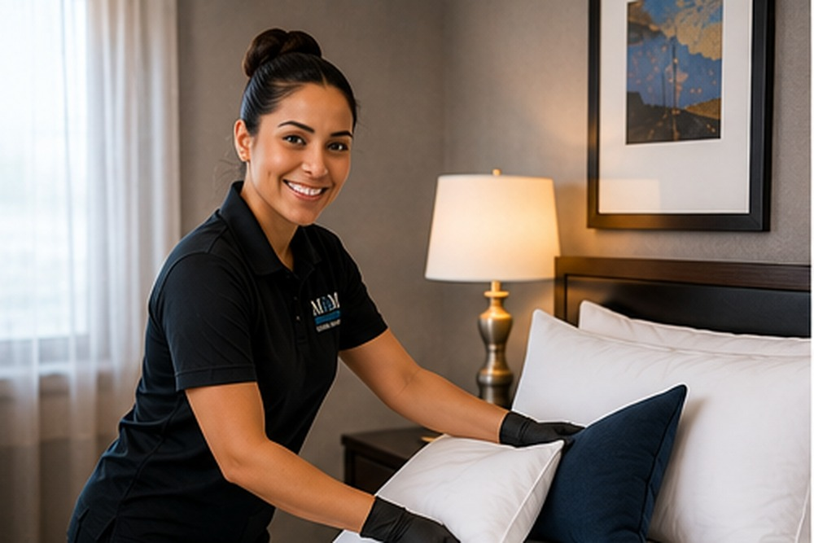
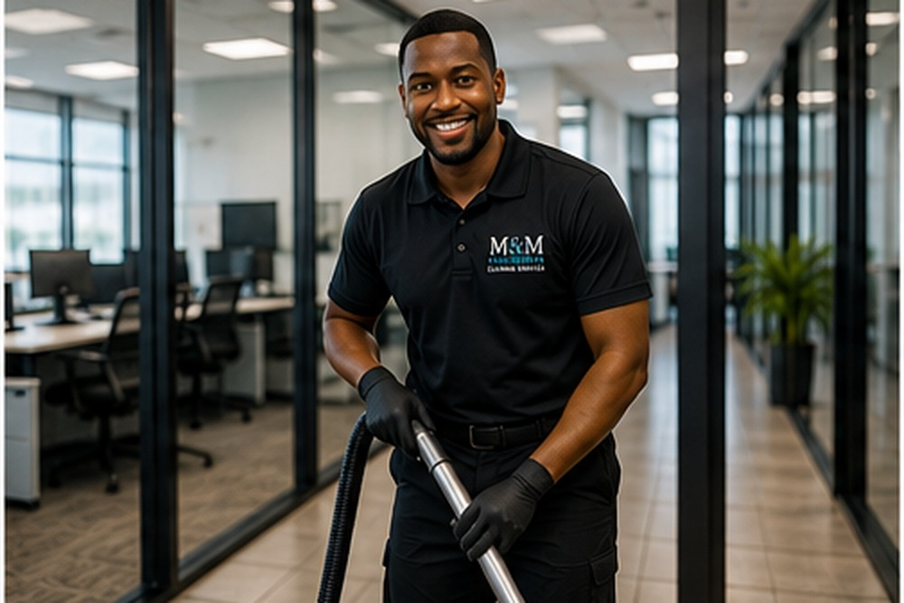
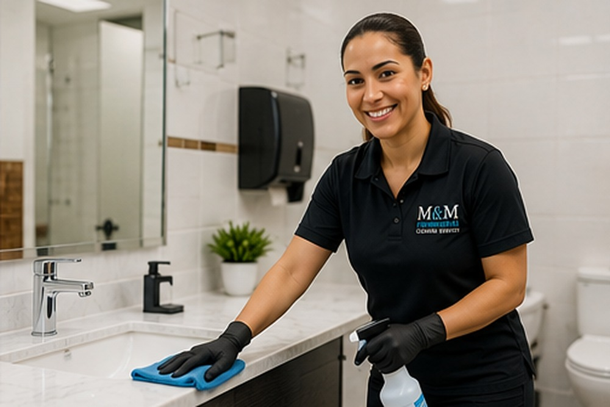
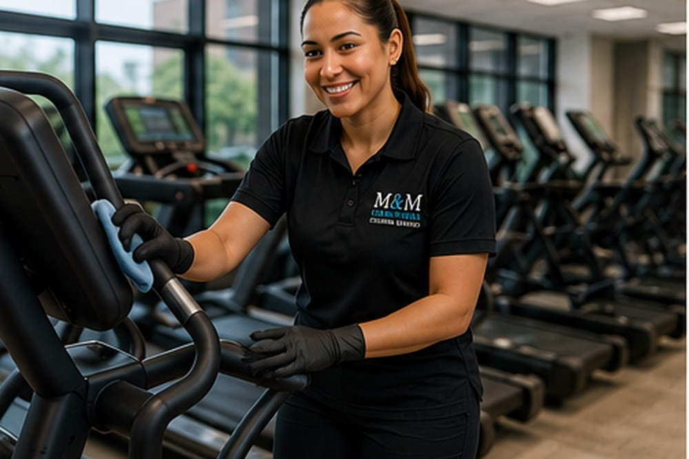
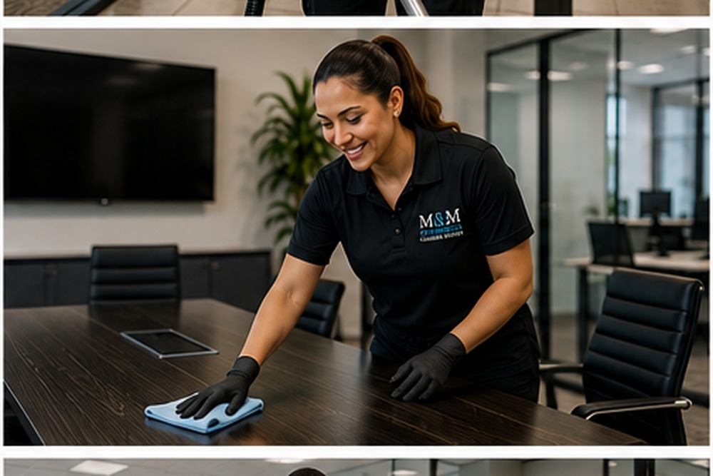
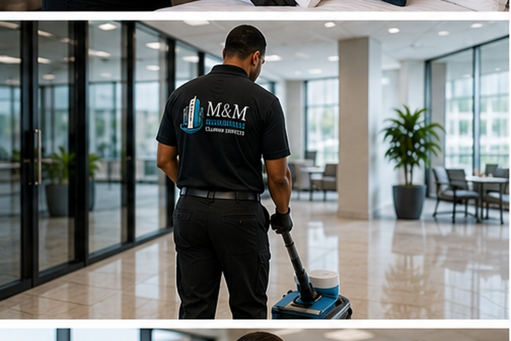

<!DOCTYPE html>
<html lang="en">
<head>
  <meta charset="utf-8" />
  <meta name="viewport" content="width=device-width, initial-scale=1.0" />
  <title>M&M Professional Cleaning Services | Commercial Cleaning Chattanooga & North Georgia</title>
  <meta name="description" content="Premium commercial, multifamily, residential, medical, office, fitness center, Airbnb, and move-in/move-out cleaning services for Chattanooga, Cleveland, Dalton, Ringgold, and North Georgia." />
  <link rel="preconnect" href="https://fonts.googleapis.com">
  <link rel="preconnect" href="https://fonts.gstatic.com" crossorigin>
  <link href="https://fonts.googleapis.com/css2?family=Inter:wght@400;500;600;700;800;900&display=swap" rel="stylesheet">
  
</head>
<body>
  

    

      Commercial • Multifamily • Residential • Airbnb • Medical • Move-In/Move-Out
      

        <a href="tel:4235807240">423-580-7240</a>
        <a href="mailto:info@mmpfcs.com">info@mmpfcs.com</a>
        <a class="portal-pill" href="https://clienthub.getjobber.com/client_hubs/b683b38a-7e7b-47af-a722-1ff25d8127e4/login/new?source=share_login" target="_blank" rel="noopener">Client Portal</a>
      

    

  

  <header class="site-header">
    

      
      <button class="menu-toggle" aria-label="Open menu">☰</button>
      <nav class="nav">
        <a href="#services">Services</a>
        <a href="#systems">Our System</a>
        <a href="#commercial">Commercial</a>
        <a href="#areas">Areas</a>
        <a href="#contact">Contact</a>
        <a class="nav-portal" href="https://clienthub.getjobber.com/client_hubs/b683b38a-7e7b-47af-a722-1ff25d8127e4/login/new?source=share_login" target="_blank" rel="noopener">Client Portal</a>
      </nav>
      <a class="quote-btn" href="#contact">Request Quote</a>
    

  </header>

  <main id="home">
    <section class="hero">
      
      

      

        

          
Where Clean Meets Excellence

          <h1>Premium Cleaning Systems for Professional Properties.</h1>
          
M&M Professional Cleaning Services LLC delivers detailed commercial, multifamily, residential, medical, Airbnb, and move-out cleaning across Chattanooga, Cleveland, Dalton, Ringgold, North Georgia, and surrounding areas.

          

            <a class="primary" href="#contact">Get a Free Quote</a>
            <a class="secondary" href="tel:4235807240">Call 423-580-7240</a>
            <a class="secondary portal" href="https://clienthub.getjobber.com/client_hubs/b683b38a-7e7b-47af-a722-1ff25d8127e4/login/new?source=share_login" target="_blank" rel="noopener">Client Portal</a>
          

          

            Detailed Checklists
            Before & After Photos
            Arrival & Completion Updates
          

        

        <aside class="hero-card">
          
          <h2>Built for Property Managers & Busy Businesses</h2>
          
No more guessing if your vendor showed up. Our process is designed for clear communication, documented work, and dependable results.

          <a href="#systems">See Our System</a>
        </aside>
      

    </section>

    <section class="metrics">
      

        
<strong>2015</strong>Cleaning experience started

        
<strong>6+</strong>Core service categories

        
<strong>24/7</strong>Flexible cleaning options

        
<strong>100%</strong>Documentation-focused process

      

    </section>

    <section class="section intro">
      

        

          
A Higher Standard

          <h2>Commercial-level detail with a client-first experience.</h2>
        

        

          
M&M Professional Cleaning Services LLC was built for clients who want more than a basic clean. We focus on reliability, communication, checklists, photo documentation, quality control, and a professional experience from the first walkthrough to the final completed job.

          
Whether you manage apartment turns, need nightly office cleaning, run a medical or dental office, operate an Airbnb, or need a detailed residential clean, our goal is to make your space look cared for and make your day less stressful.

        

      

    </section>

    <section class="section services" id="services">
      

        

          
Services

          <h2>Cleaning solutions for every professional space.</h2>
        

        

          <article>
<h3>Multifamily Turns</h3>
Move-out, make-ready, leasing office, clubhouse, hallway, and property support cleaning.

</article>
          <article>
<h3>Commercial Offices</h3>
Daily, weekly, bi-weekly, after-hours, restroom, breakroom, and workspace cleaning.

</article>
          <article>
<h3>Medical & Dental</h3>
Detail-focused cleaning for waiting rooms, offices, restrooms, exam rooms, and administrative areas.

</article>
          <article>
<h3>Fitness Centers</h3>
High-touch cleaning for gyms, restrooms, locker rooms, front desks, and common areas.

</article>
          <article>
<h3>Residential & Airbnb</h3>
Basic, maintenance, deep cleaning, turnover cleaning, and move-in/move-out services.

</article>
          <article>
<h3>Detail & Floor Care</h3>
Dusting, vacuuming, mopping, surface detailing, touch points, and final presentation work.

</article>
        

      

    </section>

    <section class="section dark" id="systems">
      

        

          
The M&M System

          <h2>No guessing. No chasing. No wondering.</h2>
          
Our process is designed to protect your time. Every job can be supported with communication, checklist documentation, and photo proof so you know what was completed without having to leave your office and inspect everything yourself.

          

            <a class="primary" href="#contact">Build My Cleaning Plan</a>
            <a class="secondary" href="https://clienthub.getjobber.com/client_hubs/b683b38a-7e7b-47af-a722-1ff25d8127e4/login/new?source=share_login" target="_blank" rel="noopener">Client Portal</a>
          

        

        

          
01<h3>Arrival Communication</h3>
Clients can receive notice when the team is on the way or arriving for the job.

          
02<h3>Detailed Checklist</h3>
Work is organized by service type so expectations are clear before and after the clean.

          
03<h3>Before & After Photos</h3>
Photo documentation helps show completed areas and reduces unnecessary callbacks.

          
04<h3>Completion Update</h3>
When the job is finished, the client gets a clear update so they can stay focused.

        

      

    </section>

    <section class="section commercial" id="commercial">
      

        
        

          
Built Like a Serious Vendor

          <h2>Designed for apartments, offices, clinics, gyms, and managers who need vendors they can trust.</h2>
          <ul class="checklist">
            <li>Professional scheduling and communication</li>
            <li>Clear scope before work begins</li>
            <li>Detailed move-in and move-out support</li>
            <li>Commercial restroom and breakroom cleaning</li>
            <li>Photo documentation available for clients</li>
            <li>Custom plans for recurring or one-time cleaning</li>
          </ul>
        

      

    </section>

    <section class="section areas" id="areas">
      

        

          
Service Areas

          <h2>Serving Chattanooga, North Georgia, and surrounding communities.</h2>
          
We support property managers, businesses, homeowners, and short-term rental hosts across the region.

        

        

          ChattanoogaClevelandHixsonEast RidgeRinggoldDaltonRossvilleFort OglethorpeLaFayetteNorth Georgia
        

      

    </section>

    <section class="section contact dark" id="contact">
      

        

          
Request a Quote

          <h2>Ready for a cleaner, more professional property?</h2>
          
Tell us what type of property you have and what kind of cleaning support you need. We’ll help create a plan that fits your schedule, budget, and standards.

          

            <a href="tel:4235807240"><strong>Call</strong>423-580-7240</a>
            <a href="mailto:info@mmpfcs.com"><strong>Email</strong>info@mmpfcs.com</a>
            <a href="https://clienthub.getjobber.com/client_hubs/b683b38a-7e7b-47af-a722-1ff25d8127e4/login/new?source=share_login" target="_blank" rel="noopener"><strong>Existing Client</strong>Client Portal</a>
          

        

        <form class="quote-form" action="https://formsubmit.co/info@mmpfcs.com" method="POST">
          <input type="hidden" name="_subject" value="New Website Quote Request - M&M Professional Cleaning Services">
          <input type="hidden" name="_captcha" value="false">
          <label>Full Name<input name="name" required></label>
          <label>Email<input type="email" name="email" required></label>
          <label>Phone<input name="phone" required></label>
          <label>Service Needed<select name="service" required><option value="">Select a service</option><option>Commercial Cleaning</option><option>Multifamily Turn Cleaning</option><option>Residential Cleaning</option><option>Deep Cleaning</option><option>Move-In / Move-Out</option><option>Airbnb Turnover</option><option>Medical / Dental Office</option><option>Fitness Center</option></select></label>
          <label>Message<textarea name="message" rows="5" placeholder="Tell us about the property, square footage, frequency, and timeline."></textarea></label>
          <button type="submit">Send Quote Request</button>
        </form>
      

    </section>
  </main>

  <footer class="footer">
    

      

Premium cleaning services for commercial, multifamily, residential, medical, Airbnb, and move-in/move-out clients.

      
<h3>Contact</h3><a href="tel:4235807240">423-580-7240</a><a href="mailto:info@mmpfcs.com">info@mmpfcs.com</a><a href="https://clienthub.getjobber.com/client_hubs/b683b38a-7e7b-47af-a722-1ff25d8127e4/login/new?source=share_login" target="_blank" rel="noopener">Client Portal</a>

      
<h3>Services</h3><a href="#services">Commercial Cleaning</a><a href="#services">Multifamily Turns</a><a href="#services">Residential Cleaning</a><a href="#services">Airbnb Cleaning</a>

      
<h3>Follow</h3><a href="https://facebook.com/mmprofessionalcleaningservices" target="_blank" rel="noopener">Facebook</a><a href="https://instagram.com/MMPROFESSIONALCLEANINGSERVICE" target="_blank" rel="noopener">Instagram</a><a href="https://www.tiktok.com/@mmpfcs" target="_blank" rel="noopener">TikTok</a>

    

    
©  M&M Professional Cleaning Services LLC. All rights reserved.

  </footer>

  
</body>
</html>
